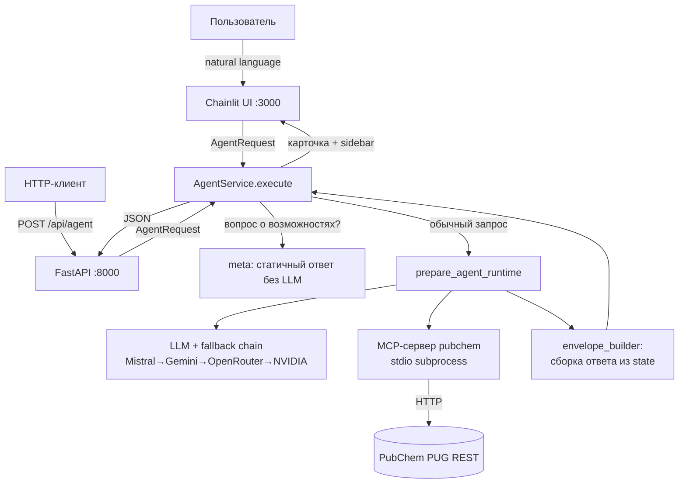
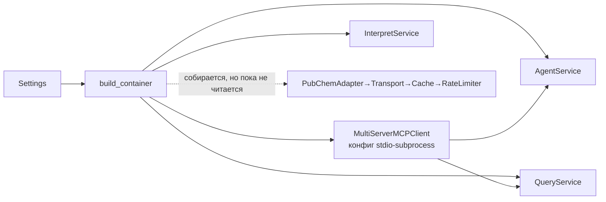
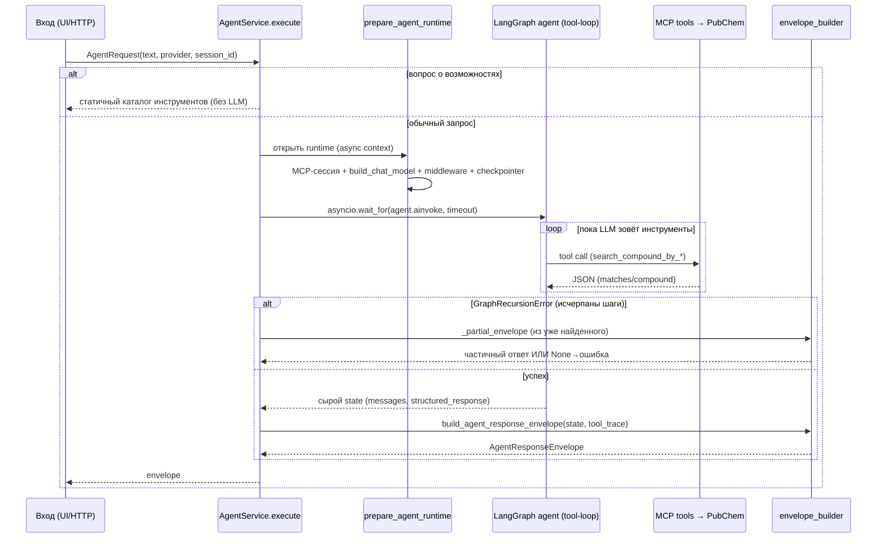

# Архитектура PubChem RAG Agent

> Канонический документ архитектуры. Описывает, **как устроена и как работает вся
> система** — от пользовательского запроса до ответа. Цель — чтобы новый человек
> (или агент) разобрался в проекте за один проход. Поддерживайте документ в
> актуальном состоянии при изменениях кода.
>
> **Последнее обновление:** 2026-06-08. **Репозиторий:** `github.com/Arina-bear/PubChem-RAG-Agent`.

---

## 1. Назначение и контекст

**PubChem RAG Agent** — химический поисковый агент, который по запросу на
естественном языке находит вещества в базе [PubChem](https://pubchem.ncbi.nlm.nih.gov)
и возвращает структурированный ответ: текстовое объяснение + карточку вещества
(структура, формула, масса, ключевые свойства).

- **Кто пользователь:** студенты/стажёры; проект делается в рамках стажировки в ТГУ.
- **Чем это НЕ является:** это **не классический RAG** (название историческое).
  Здесь нет векторного индекса и эмбеддингов — «знание» берётся вызовами
  инструментов к живому API PubChem (tool-calling), а LLM лишь оркестрирует поиск
  и формулирует ответ. Поддерживается только домен `compound` (отдельные вещества).

Идея в одну фразу: **LLM выбирает и вызывает инструменты PubChem, а код превращает
сырой результат в аккуратный ответ и карточку.**

---

## 2. Карта системы за 60 секунд

Две точки входа сходятся в одном ядре. Презентация различается — **бизнес-логика
не дублируется**.



Поток запроса (коротко): **вход → `AgentRequest` → `AgentService.execute` →
(ярлык для вопросов о возможностях ИЛИ) сборка runtime → tool-loop LLM↔PubChem →
реконструкция ответа (`envelope_builder`) → презентация (JSON или карточка).**

---

## 3. Структура проекта

```
backend/
  src/
    app/
      main.py            # Точка входа №1: фабрика FastAPI-приложения
      container.py       # Ручной DI-контейнер (build_container)
      config.py          # Pydantic Settings (.env), get_settings() singleton
      api/routes/        # HTTP-роуты: health, query, interpret, agent
      agent/             # Ядро агента (LangChain 1.x)
        runtime.py       #   сборка агента: model + tools + middleware + checkpointer
        model_factory.py #   фабрика LLM + fallback chain + rate-limiters
        rate_limiters.py #   per-provider RPM token-bucket (InMemoryRateLimiter)
        persistence.py   #   checkpointer памяти диалога (Postgres / InMemory)
        meta.py          #   ярлык «какие у тебя инструменты?» без LLM
        prompts.py       #   системный промпт агента
        error_mapper.py  #   исключения LangChain → AppError
        tracing.py       #   ToolTraceRecorder + Langfuse
        mcp_server.py    #   FastMCP-сервер (stdio subprocess) — регистрация tools
        mcp_tools/       #   реализация инструментов поиска по PubChem
      services/          # Сервисный слой (бизнес-логика)
        agent_service.py     #   ЕДИНАЯ точка входа агента (NL → tools → envelope)
        envelope_builder.py  #   реконструкция ответа из сырого state LangGraph
        query_service.py     #   типизированный поиск без LLM (через MCP tools)
        interpret_service.py #   разбор NL-запроса + подтверждение
        cache.py, rate_limit.py  # см. §6 (типизированный путь, пока не подключён)
      adapter/pubchem_adapter.py   # типизированный доступ к PubChem (пока не подключён)
      transport/pubchem.py         # httpx + tenacity retry (пока не подключён)
      normalizers/compound.py      # нормализация payload PubChem (пока не подключён)
      schemas/           # Pydantic-контракты (agent, query, interpret, common, schemas)
      errors/            # AppError, ErrorCode, нормализатор ответов-ошибок
      presenters/compound_card.py  # props для JSX-карточки + markdown боковой панели
    chainlit_app.py      # Точка входа №2: Chainlit UI
  public/elements/CompoundCardV2.jsx  # rich-карточка вещества (React/JSX)
  public/custom.css, custom.js, theme.json
  tests/                 # pytest (часть тестов устарела — см. §15)
docs/                    # knowledge files (этот файл — канон архитектуры)
infra/                   # langfuse-compose.yml, chainlit_schema.sql, docker-compose.yml
scripts/dev.sh           # запуск dev-окружения (uvicorn + chainlit)
frontend/                # МЁРТВЫЙ legacy Next.js MVP (не запускать, не целевой UI)
```

---

## 4. Две точки входа и единое ядро

Обе точки входа собирают один и тот же `AgentRequest` и вызывают один и тот же
метод `AgentService.execute(...)`. Это и есть «единая точка входа» на уровне логики.

| | FastAPI (`app/main.py`, порт 8000) | Chainlit (`src/chainlit_app.py`, порт 3000) |
|---|---|---|
| Назначение | программный HTTP-API | основной UI для людей |
| DI-контейнер | **глобальный**, один на процесс, в `app.state.container` (создаётся в `lifespan`) | **per-session**, свой на пользователя, в `cl.user_session` (`_get_or_create_container`) |
| ID диалога (память) | заголовок `X-Session-Id` (опционально) → `thread_id` | `cl.context.session.thread_id` (свежий UUID на каждый чат) |
| Презентация | `JSONResponse` (envelope целиком) | карточки `CompoundCardV2` + боковая панель + шаги `cl.Step` |
| Langfuse-метаданные | базовые | session/user/tags из Chainlit-сессии |
| **Общее** | **`AgentRequest(text, provider, include_raw)` → `agent_service.execute(...)`** | то же |

Важно: Chainlit вызывает сервис **напрямую in-process**, а не ходит в `/api/agent`
по HTTP. Никакого отдельного «стрим-сервиса» нет.

---

## 5. DI-контейнер (`build_container`)

Зависимости собираются вручную в один dataclass `AppContainer` — без DI-фреймворка
(для проекта такого размера это проще и нагляднее). `build_container(settings)`
создаёт граф объектов и конфигурирует MCP-клиент.



MCP-сервер запускается как **subprocess** (`python -m app.agent.mcp_server`) по
транспорту **stdio**. В `env` subprocess'а прокидывается `PYTHONPATH=<путь к src>`,
чтобы дочерний процесс видел пакет `app.*`.

`AppContainer.close()` (вызывается при shutdown FastAPI и в `on_chat_end` Chainlit)
делает `flush` Langfuse и закрывает HTTP-транспорт.

---

## 6. Ядро-компоненты и границы ответственности

Три уровня доступа к данным были задуманы как «слои», но сейчас реально работает
**только MCP-линия**. Это важно понимать, чтобы не искать логику не там.

### 6.1. MCP-линия — **активный путь к PubChem**
- `agent/mcp_server.py` — регистрирует 6 инструментов в FastMCP.
- `agent/mcp_tools/` — их реализация:
  - `base_search.py` — `search_compound_by_name / _smiles / _formula / _inchikey`
    (валидация входа Pydantic-схемой, URL-кодирование, запрос к PUG REST);
  - `structural.py` — `search_substructure_pubchem` (поиск по подструктуре, RDKit);
  - `similar_search.py` — `search_by_similar_mol_pubchem` (2D-сходство, `fastsimilarity_2d`);
  - `search_cid.py` — **общая механика** `perform_search` (поиск CID, поллинг
    асинхронного `ListKey`, дозагрузка свойств `_fetch_props`). Все запросы к
    PubChem сериализуются глобальным семафором (`Semaphore(1)`) — щадим free-tier.
- Эту линию вызывают и агент (через MCP-сессию), и `QueryService`.

### 6.2. Типизированный слой — **собран, но пока не подключён**
`PubChemAdapter` (+ `PubChemTransport` с retry/backoff на tenacity, `TTLCache`,
`SlidingWindowRateLimiter`, `normalizers/compound.py`) — это более «инженерная»
альтернатива доступа к PubChem (кэш, ретраи, нормализация, корректные имена SMILES).
Исторически это задумывалось как «единственная точка доступа к PubChem», но после
перехода на MCP-инструменты **ни один код его методы не вызывает** (объект строится
в контейнере, но не читается). Слой сохранён как запасной типизированный путь;
при необходимости на него можно перевести `mcp_tools` (это уберёт дублирование и
починит часть свойств «бесплатно»). Подробнее — §16 «осознанный долг».

### 6.3. Сервисный слой
- **`AgentService`** — единая точка входа агента: принимает NL-запрос, даёт LLM
  самому выбирать инструменты, возвращает `AgentResponseEnvelope`. См. §7.
- **`QueryService`** — типизированный поиск **без LLM**: `input_mode` → имя
  MCP-инструмента → вызов → нормализация. Используется роутом `POST /api/query`.
- **`InterpretService`** — лёгкий разбор NL-текста и предложение вариантов запроса
  с обязательным подтверждением (роут `POST /api/interpret`).

---

## 7. Жизненный цикл одного запроса агента



Ключевые детали `prepare_agent_runtime` (`agent/runtime.py`):

1. **MCP-сессия:** `mcp_client.session("pubchem")` → `load_mcp_tools(session)`
   читает схемы инструментов из subprocess'а — LLM «видит» набор tools.
2. **Модель:** `build_chat_model(settings, provider)` (см. §12) — primary +
   fallback chain, обёрнутые в `with_config(max_concurrency=1)`.
3. **Middleware-стек** (порядок = вложенность, внешний → внутренний):
   1. `record_tool_invocations` — пишет каждый tool-call в `ToolTraceRecorder`
      (стоит первым, чтобы видеть и реальные ответы, и short-circuit от guard'а);
   2. `deduplicate_pubchem_tool_calls` — блокирует повторный вызов с теми же
      аргументами (`DUPLICATE_TOOL_CALL`), экономит запросы к API;
   3. `ToolCallLimitMiddleware` — жёсткий лимит на число tool-вызовов за run;
   4. `ContextEditingMiddleware` — при >60k токенов отбрасывает старые
      `ToolMessage` **перед** вызовом LLM (checkpointer хранит полную историю).
4. **Checkpointer:** `get_checkpointer(settings)` (см. §9) — память диалога.
5. **`create_agent(...)`** собирает ReAct-граф LangChain 1.x.
6. **`invoke_config`:** `recursion_limit = max(8, agent_max_steps*2+2)`,
   `max_concurrency=1`, `configurable.thread_id`.

Сборка ответа (`services/envelope_builder.py`): из сырого state извлекаются и
дедуплицируются `matches`/`compounds` (по CID из `tool_trace`); `final_answer` —
последний непустой `AIMessage`, а если LLM вернул пустой ответ при наличии данных
— синтезируется короткий текст из данных PubChem на языке запроса; эвристиками
восстанавливаются `parsed_query`, `explanation`, `clarification`, `warnings`.

---

## 8. MCP-подсистема (ранее не была задокументирована)

- **Что это:** инструменты поиска вынесены в отдельный процесс — MCP-сервер
  (`mcp_server.py`, фреймворк FastMCP). Агент общается с ним по протоколу **MCP**
  поверх **stdio** через `langchain-mcp-adapters` (`MultiServerMCPClient`).
- **Почему так:** MCP даёт чёткую границу «инструменты ↔ агент» и переиспользуемость
  (рекомендация наставника). Инструменты не зависят от конкретной LLM.
- **Регистрация:** в `mcp_server.py` функции из `mcp_tools/*` оборачиваются
  `mcp.tool()`. `if __name__ == "__main__": mcp.run(transport="stdio")` — точка
  входа subprocess'а.
- **6 активных инструментов:** `search_compound_by_name`, `_by_smiles`, `_by_formula`,
  `_by_inchikey`, `search_substructure_pubchem`, `search_by_similar_mol_pubchem`.
- **Путь tool-call:** LLM выбирает инструмент → `MultiServerMCPClient` →
  stdio → `mcp_server` → функция в `mcp_tools/` → HTTP GET к PUG REST → (при 202
  поллинг `ListKey`) → параллельная дозагрузка свойств по каждому CID → JSON
  обратно агенту.

**Как добавить новый инструмент:** (1) Pydantic-схема входа в `schemas/schemas.py`;
(2) async-функция в `mcp_tools/` (вернуть `dict` вида `{"ok": bool, "matches": [...]}`);
(3) зарегистрировать `mcp.tool()(имя)` в `mcp_server.py`; (4) при необходимости —
добавить `input_mode` в `MCP_LOOKUP_MAP` (`envelope_builder.py`) и маппинг в
`QueryService._map_input_to_tool`.

---

## 9. Память и персистентность (две независимые системы)

Это частый источник путаницы — системы **разные** и работают независимо.

| | Память агента | История чатов в UI |
|---|---|---|
| Что хранит | контекст диалога, который «помнит» LLM | список диалогов в sidebar, сообщения |
| Технология | **LangGraph checkpointer** (`persistence.py`) | **Chainlit data layer** (`SQLAlchemyDataLayer`) |
| Ключ | `thread_id` | пользователь + thread |
| Хранилище | `AsyncPostgresSaver` если задан `AGENT_CHECKPOINT_POSTGRES_URL`, иначе `InMemorySaver` | Postgres по `DATABASE_URL` |
| Где работает | в обоих входах (не зависит от UI) | только в Chainlit |

- **Checkpointer** — singleton с ленивой инициализацией под `asyncio.Lock`
  (double-check, чтобы при гонке не утёк второй пул соединений).
- **Data layer** регистрируется **только** если `DATABASE_URL` задан **и** база
  реально доступна со схемой: `_data_layer_ready()` коннектится через asyncpg и
  проверяет наличие таблицы `users` (`to_regclass('public.users')`). Это защита от
  ошибки `Not Found: User not found` (HTTP 404), которая возникала, когда Postgres
  поднят, но схема не применена. Без БД — graceful degradation: UI работает без
  истории, но без красных ошибок.

> **⚠️ Известное ограничение (баг фреймворка Chainlit, не проекта).** Без
> настроенного storage provider (S3/GCS/Azure/локальный) элементы `CustomElement`
> (карточка `CompoundCardV2`), картинка структуры и боковая панель **не
> персистятся** и **не восстанавливаются при resume** — переживают только
> текстовые root-level сообщения. Поэтому финальный ответ отправляется как
> root-level сообщение (`parent_id=None`): промежуточные `cl.Step` при `cot=hidden`
> не сохраняются, и привязка ответа к ним делала бы его «сиротой» при resume
> (раньше из-за этого в истории были видны только запросы, без ответов агента).

---

## 10. Лимиты и устойчивость

Три **разных** лимита, которые легко спутать (документируем явно):

1. **`recursion_limit`** (`runtime.py`, `invoke_config`) — лимит **узлов графа**
   LangGraph. Один логический шаг агента ≈ 2 узла (LLM-node + tool-routing-node),
   поэтому `max(8, agent_max_steps*2+2)`. Это **не** число tool-вызовов.
2. **`ToolCallLimitMiddleware.run_limit`** — лимит **числа tool-вызовов** за run.
3. **`ClearToolUsesEdit(trigger=60_000)`** — **токен-порог** trim'а истории
   (≈ половина floor'а 128k у NVIDIA Llama 3.3 70B).

Три уровня rate-limiting (под free-tier провайдеров):

1. **Конкурентность агента** — `max_concurrency=1`: один LLM-запрос за раз.
2. **PubChem** — `SlidingWindowRateLimiter` + глобальный `Semaphore(1)` в `search_cid`.
3. **Per-provider RPM** — `InMemoryRateLimiter` (token bucket) на каждого
   провайдера, общий на весь процесс (см. `rate_limiters.py`, лимиты в `config.py`).

Устойчивость: ретраи с backoff (tenacity) на уровне транспорта; дедупликация
tool-call; **graceful degradation** — при `GraphRecursionError` `_partial_envelope`
возвращает карточку из уже найденных веществ вместо голой ошибки; любое другое
исключение проходит через `normalize_agent_exception` → единый `AppError`.

---

## 11. Контракты и обработка ошибок

**Активные эндпоинты:**

| Метод | Путь | Назначение |
|---|---|---|
| GET | `/api/health` | статус и конфигурационные метаданные |
| POST | `/api/query` | типизированный поиск (без LLM), `QueryService` |
| POST | `/api/interpret` | разбор NL + предложение запроса, `InterpretService` |
| POST | `/api/agent` | агентный поиск (NL → tools), `AgentService` |

**Ключевые схемы** (`schemas/`): `AgentRequest` (вход агента), `ParsedAgentQuery`
(разобранный запрос), `AgentResponseEnvelope` / `AgentNormalizedPayload` (ответ
агента), `CompoundOverview` / `CompoundMatchCard` (вещество/кандидат),
`QueryRequest` / `QueryResponseEnvelope` (типизированный поиск).

**Ошибки** едины для всех путей: `AppError(code, message, http_status, retriable)`
с каталогом `ErrorCode` (`VALIDATION_ERROR`, `NO_MATCH`, `AMBIGUOUS_QUERY`,
`RATE_LIMITED`, `UPSTREAM_TIMEOUT`, `UPSTREAM_UNAVAILABLE`, `UNSUPPORTED_QUERY`, …).
В `main.py` зарегистрированы централизованные обработчики (`RequestValidationError`
и общий `Exception`), которые формируют ответ-ошибку по суффиксу URL.

---

## 12. Внешние интеграции

- **PubChem PUG REST** — источник химических данных. Активно — через MCP-инструменты
  (`mcp_tools/*`); типизированный `PubChemAdapter` — запасной путь (§6.2).
- **LLM-провайдеры и fallback chain** (`model_factory.py`). Primary по умолчанию —
  **Mistral Medium 3.5** (самый щедрый free-tier). Цепочка отказоустойчивости через
  `Runnable.with_fallbacks(...)`:

  ```
  mistral → gemini → openrouter → nvidia
  ```

  Если primary падает (rate-limit, 5xx и т.п.) и настроен следующий провайдер —
  LangChain прозрачно повторяет запрос по цепочке. Канон по провайдерам/лимитам —
  [`docs/llm-providers.md`](llm-providers.md). Primary меняется через
  `LLM_DEFAULT_PROVIDER` (или селектором ⚙️ в Chainlit).
- **Langfuse v3** (self-host, `infra/langfuse-compose.yml`) — трассировка agent-run'ов;
  тэги трейсов: `pubchem-agent`, `mcp-architecture`, имя провайдера.

---

## 13. Развёртывание и окружение

- **Dev-запуск:** `scripts/dev.sh` поднимает оба процесса параллельно (из `backend/`):
  - `uvicorn app.main:app --app-dir src ... --port 8000`
  - `chainlit run src/chainlit_app.py --headless ... --port 3000`

  и синхронизирует их жизненный цикл (общий `trap`/health-loop). Зависимости —
  `uv sync` перед стартом.
- **Инфраструктура:** `infra/langfuse-compose.yml` (Langfuse v3),
  `infra/chainlit_schema.sql` (официальная схема data layer 2.11). Применить схему:
  `psql -d chainlit -f infra/chainlit_schema.sql`.
- **Окружение (`.env`):** ключи провайдеров, `DATABASE_URL`,
  `AGENT_CHECKPOINT_POSTGRES_URL`, `CHAINLIT_AUTH_SECRET`, Langfuse-ключи.

> **⚠️ `backend/.env.example` устарел:** содержит `LLM_DEFAULT_PROVIDER=modal_glm`
> и не описывает ключи Mistral/Gemini/OpenRouter/NVIDIA. Реальный default —
> `mistral` (см. `config.py` и `docs/llm-providers.md`).

---

## 14. Безопасность

- **Аутентификация Chainlit** — `@cl.password_auth_callback`: сейчас это **dev-заглушка**
  (любой непустой username проходит, `identifier=username` изолирует чаты пользователя).
  Для production заменить на проверку БД / OAuth / SSO.
- **API-ключи** хранятся в `.env` (gitignored), читаются как `SecretStr`.
- **CORS** — allowlist (`cors_origins`), по умолчанию только localhost:3000.
- **Telemetry** Chainlit отключена в `config.toml`.

---

## 15. Разработка и тесты

- **Тесты:** `pytest` в `backend/tests/`. ⚠️ Часть тестов **устарела** (ссылаются на
  удалённые при рефакторинге символы — напр. `AgentService(adapter=...)`,
  `ManualQuerySpec`, `app.agent.mcp_client`) и не собирается/падает **независимо от
  свежих изменений**. Это известный долг (нужно привести тесты к текущим контрактам).
  Запуск (с учётом разнобоя в корне импортов): `cd backend && PYTHONPATH=. uv run pytest -q`.
  Мокинг PubChem — через `respx`.
- **Линт:** `uvx ruff check src --select F,E9` (зелёный).
- **Системный промпт** один — `agent/prompts.py`. (Ранее существовал
  `prompts_advanced.py` для «сильных» моделей, но он не был подключён к рантайму и
  удалён как мёртвый код; при необходимости длинный промпт восстановим из git.)

---

## 16. Осознанный технический долг

Решения, оставленные намеренно на текущей итерации (риск churn выше пользы):

- **Типизированный слой доступа к PubChem не подключён** (§6.2). Оставлен как
  запасной путь. Кандидат на будущее: перевести `mcp_tools` на `PubChemAdapter`
  (единый источник доступа, кэш/ретраи, корректные имена SMILES) либо удалить слой.
- **Маршрутизация ошибок по суффиксу URL** в `main.py` — работает для текущих 4
  роутов; переход на теги роутов отложен (YAGNI, версионирования API нет).
- **`frontend/` (Next.js)** — мёртвый legacy MVP. Физически присутствует, но не
  целевой UI и не запускается. Не путать с актуальным Chainlit-UI.
- **Устаревшие тесты и `.env.example`** (§13, §15) — требуют синхронизации с кодом.

---

## 17. Глоссарий

| Термин | Значение |
|---|---|
| **CID** | PubChem Compound ID — числовой идентификатор вещества |
| **PUG REST** | HTTP-API PubChem (`/rest/pug/...`) |
| **ListKey** | токен асинхронного поиска PubChem (ответ 202 → поллинг результата) |
| **MCP** | Model Context Protocol — протокол «инструменты ↔ агент» |
| **checkpointer** | хранилище состояния диалога LangGraph (по `thread_id`) |
| **thread_id** | стабильный ID диалога; ключ памяти агента |
| **envelope** | `AgentResponseEnvelope` — единая обёртка ответа (normalized + warnings + error) |
| **capability question** | вопрос «что ты умеешь?» — отвечается статично, без LLM |
| **fallback chain** | цепочка LLM-провайдеров для отказоустойчивости |
| **data layer** | подсистема Chainlit для хранения истории чатов в БД |
```
